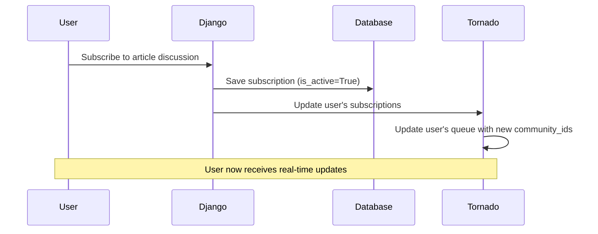
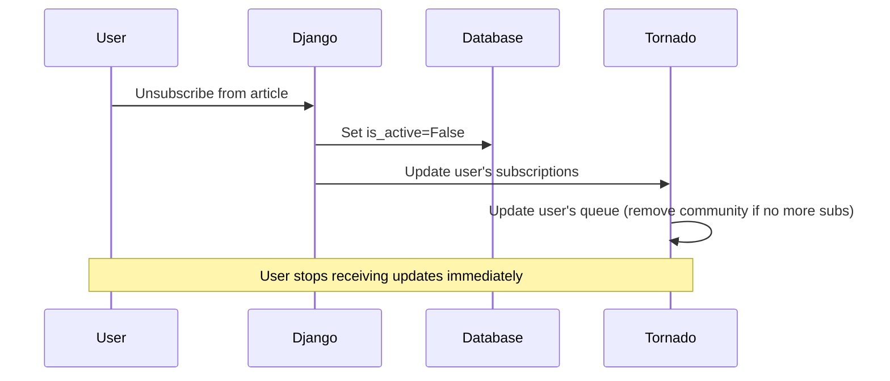
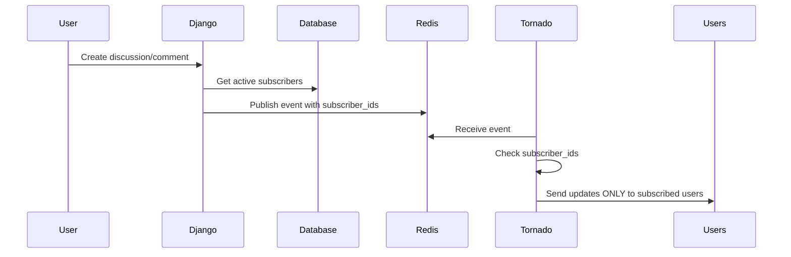

# Real-Time Subscription System - Complete Integration Guide

## 🎯 Overview

This document describes the **real-time subscription system** that enables users to receive instant updates for discussions and comments in private/hidden community articles.

---

## 🔄 **How It Works**

### **1. Subscription Flow**



### **2. Unsubscribe Flow**



### **3. Event Publishing Flow**



---

## 🚀 **Key Components**

### **1. Subscription APIs** (`articles/discussion_api.py`)

#### **Subscribe to Discussion**
```python
POST /api/discussions/subscribe/
Body: {
    "community_article_id": 123,
    "community_id": 45
}
```
- ✅ Creates/reactivates subscription
- ✅ **Immediately** notifies Tornado server
- ✅ User starts receiving updates **instantly**

#### **Unsubscribe from Discussion**
```python
DELETE /api/discussions/unsubscribe/{subscription_id}/
```
- ✅ Sets `is_active=False` (soft delete)
- ✅ **Immediately** notifies Tornado server
- ✅ User stops receiving updates **instantly**

#### **Update Subscription**
```python
PUT /api/discussions/subscription/{subscription_id}/
Body: {
    "is_active": false
}
```
- ✅ Toggle subscription on/off
- ✅ **Immediately** notifies Tornado server

#### **Check Subscription Status**
```python
GET /api/discussions/subscription-status/?community_article_id=123&community_id=45
```
- Returns current subscription status

#### **Get User Subscriptions**
```python
GET /api/discussions/user-subscriptions/
```
- Returns all subscriptions grouped by community

---

### **2. Real-Time System** (`myapp/realtime.py`)

#### **New: Dynamic Subscription Updates**
```python
RealtimeQueueManager.update_user_subscriptions(user_id, community_ids)
```
- Called automatically after subscribe/unsubscribe
- Updates Tornado server **immediately**
- No need to re-register queue

#### **Event Publishing**
All events include `subscriber_ids` list:
```python
{
    "type": "new_discussion",
    "data": {
        "discussion": {...},
        "subscriber_ids": [1, 2, 3, 4]  # ← Only these users receive the event
    },
    "community_ids": [45],
    "exclude_user_id": 1  # Author doesn't receive their own event
}
```

#### **Subscriber Validation**
```python
should_user_receive_event(user_id, community_id, subscriber_ids)
```
- Checks if user should receive an event
- Uses subscriber_ids if provided
- Fallback to community membership

---

### **3. Tornado Server Integration**

Your Tornado server needs to implement:

#### **New Endpoint: Update Subscriptions**
```python
POST /realtime/update-subscriptions
Body: {
    "user_id": 123,
    "community_ids": [45, 67, 89]
}
```

**Implementation:**
1. Find user's existing queue by `user_id`
2. Update the queue's `community_ids` list
3. User immediately starts/stops receiving events based on new subscriptions

---

## 🎯 **Event Delivery Logic**

### **Tornado Server Should:**

1. **Check subscriber_ids First** (if provided in event):
   ```python
   if 'subscriber_ids' in event['data']:
       if user_id not in event['data']['subscriber_ids']:
           return  # Don't deliver event
   ```

2. **Check community membership** (fallback):
   ```python
   if community_id in user_queue['community_ids']:
       deliver_event()
   ```

3. **Exclude author**:
   ```python
   if user_id == event['exclude_user_id']:
       return  # Don't deliver to author
   ```

---

## 🔧 **Auto-Subscription Integration**

### **When Auto-Subscriptions Are Created:**

1. **Article Published** to private/hidden community
   - All community admins → subscribed
   - Article submitter (if member) → subscribed

2. **User Promoted to Admin**
   - Subscribed to all published articles in that community

3. **Community Type Changed** (Public → Private/Hidden)
   - Admins subscribed to existing published articles

4. **Manual Subscription** via API
   - User explicitly subscribes

### **Auto-Subscriptions Trigger Tornado Updates:**
The auto-subscription code in `communities/articles_api.py` and `communities/members_api.py` already calls the subscription APIs, which automatically trigger Tornado updates.

---

## ✅ **Benefits**

### **1. Immediate Effect**
- ✅ Subscribe → Start receiving updates **instantly**
- ✅ Unsubscribe → Stop receiving updates **instantly**
- ❌ No need to re-register queue or refresh page

### **2. Efficient**
- ✅ Only subscribed users receive events
- ✅ Single database query per event
- ✅ No unnecessary network traffic

### **3. Resilient**
- ✅ Graceful degradation if Tornado is down
- ✅ Subscription still saved in database
- ✅ Comprehensive error logging
- ✅ Non-blocking (real-time failures don't break main flow)

### **4. Scalable**
- ✅ Works with hundreds of concurrent users
- ✅ Optimized database queries
- ✅ Efficient event filtering

---

## 🧪 **Testing Guide**

### **Test Scenario 1: Subscribe & Receive Updates**

1. User A subscribes to article discussion:
   ```bash
   POST /api/discussions/subscribe/
   ```

2. User B creates a discussion in that article:
   ```bash
   POST /api/articles/{article_slug}/discussions/
   ```

3. **Expected**: User A receives real-time notification immediately

4. User B adds a comment:
   ```bash
   POST /api/discussions/{discussion_id}/comments/
   ```

5. **Expected**: User A receives real-time comment notification

### **Test Scenario 2: Unsubscribe & Stop Receiving**

1. User A unsubscribes:
   ```bash
   DELETE /api/discussions/unsubscribe/{subscription_id}/
   ```

2. User B creates another comment

3. **Expected**: User A does NOT receive any notification

### **Test Scenario 3: Auto-Subscription**

1. Admin publishes article to private community

2. **Expected**: 
   - All admins are auto-subscribed
   - Article submitter is auto-subscribed
   - All start receiving real-time updates

3. New user promoted to admin:
   ```bash
   POST /api/communities/{community_id}/manage-member/{user_id}/promote_admin
   ```

4. **Expected**: New admin is auto-subscribed to all published articles

---

## 📊 **Database Queries**

### **Optimized Subscription Queries:**

```sql
-- Get active subscribers (single query)
SELECT user_id 
FROM discussion_subscription 
WHERE community_article_id = ? 
  AND community_id = ? 
  AND is_active = TRUE;
```

### **Efficient Event Publishing:**
- 1 query to get subscribers
- 1 Redis publish operation
- Tornado handles distribution

---

## 🔐 **Security Considerations**

1. **Authorization Checks:**
   - ✅ Only community members can subscribe
   - ✅ Only private/hidden communities support subscriptions
   - ✅ Users can only unsubscribe their own subscriptions

2. **Data Privacy:**
   - ✅ Only subscribed users receive events
   - ✅ Authors don't receive their own events
   - ✅ Events respect community privacy settings

---

## 📝 **API Response Examples**

### **Subscribe Response:**
```json
{
    "id": 123,
    "community_article_id": 45,
    "community_id": 67,
    "article_id": 89,
    "subscribed_at": "2025-10-02T10:30:00Z",
    "is_active": true
}
```

### **Get User Subscriptions Response:**
```json
{
    "communities": [
        {
            "community_id": 67,
            "community_name": "AI Research Group",
            "articles": [
                {
                    "article_id": 89,
                    "article_title": "GPT-5 Architecture",
                    "article_slug": "gpt-5-architecture"
                },
                {
                    "article_id": 91,
                    "article_title": "Transformer Improvements",
                    "article_slug": "transformer-improvements"
                }
            ]
        }
    ]
}
```

---

## 🎉 **Summary**

The real-time subscription system is now:
- ✅ **Immediate**: Updates happen instantly
- ✅ **Efficient**: Optimized queries and event filtering
- ✅ **Resilient**: Graceful error handling
- ✅ **Scalable**: Handles hundreds of concurrent users
- ✅ **Production-Ready**: Comprehensive logging and monitoring

**Next Steps for Tornado Server:**
1. Implement `/realtime/update-subscriptions` endpoint
2. Update event delivery logic to check `subscriber_ids`
3. Test the full flow end-to-end

